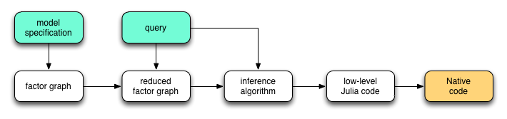
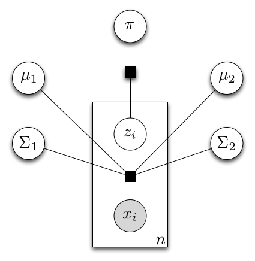

The Inference Framework
========================

The diagram below outlines the overall architecture of the inference framework. 

The entire process of generating inference codes from model and query specification consists of four stages:

1. The ``@model`` macro will convert a model specification into a model class, of which the internal representation is a factor graph.

2. The ``@query`` macro will reduce the factor graph based on the query. The reduction may involve following steps: 

    (a) Simplify factors by absorbing known variables. For example, a second-order factor (i.e. a factor with two arguments) :math:`f(x, y)` can be reduced to a first-order factor if the value of one variable (say :math:`y`) is given. 
    
    (b) Eliminate irrelevant variables and factors: variables and factors that do not influence the conditional distribution of the queried variables can be safely removed. For example, consider a joint distribution :math:`p(x, y, z) = p_1(x | z) p_2(y | z)`. When the value of :math:`y` is given, the variable :math:`y` is conditionally independent from :math:`x`. Therefore, the variable :math:`y` can be ignored in the inference for :math:`x`.
    
   The macro ``@query`` also generates a high-level description of the inference algorithm.  
   
3. An *inference compiler* will compiles the inference algorithm into low-level Julia codes, taking into account the computational architecture of the target platform (e.g. CPU cores, GPU, cluster, cloud, etc).

4. Finally, the Julia compiler will emit LLVM instructions, which will then be compiled into native codes by the LLVM compiler. 

Here, we focus on the first two steps, that is, compilation of model and query specifications into inference algorithms.

Gaussian Mixture Model Revisited
---------------------------------

To illustrate the procedure of model compilation, let's revisit the Gaussian mixture model (GMM). Given a model specification, the ``@model`` macro creates a *factor graph*, which is a hyper-graph with factors connecting between variables. The following diagram is the factor graph that represents a GMM with two components.

In this graph, each sample is associated with two factors, a ``mixture factor`` that connects between observed samples, components, and component indicator :math:`z_i`, and a factor that specifies the prior of each component indicator. These two factors were directly specified in the model specification. In the *model learning query*, the data ``x`` are given. Therefore the order of each mixture factor is reduced from :math:`2 K + 2` to :math:`2 K + 1`.

The most widely used learning algorithm for this purpose is *Expectation Maximization*, which comprises three updating steps, as outlined below.

* Update the poterior probabilities of :math:`z_i` conditioned on prior :math:`\pi`, component parameters :math:`(\mu_k, \Sigma_k)`, and the corresponding observed sample :math:`x_i`, as

    .. math:: 
    
        q_i(k) := p(z_i = k | \pi, \theta, x_i) & \propto \pi(k) \mathcal{N}(x_i; \mu_k, \Sigma_k) \\
        & = \exp \left( \log \pi(k) + \log \mathcal{N}(x_i; \mu_k, \Sigma_k) \right)
        
 This can be interpreted as an integration of a message from the prior factor (that is, :math:`\log \pi(k)`) and a message from the corresponding mixture factor (that is, :math:`\log \mathcal{N}(x_i; \mu_k, \Sigma_k)`). Here, :math:`\log \mathcal{N}(x_i; \mu_k, \Sigma_k)` denotes the pdf at :math:`x_i` with respect to a Gaussian component. 

* Update the maximum likelihood estimation of :math:`\pi`, as

    .. math::
    
        \pi(k) = \frac{1}{n} \sum_{i=1}^n p(z_i = k) = \frac{1}{n} \sum_{i=1}^n \exp ( \log q_i(k) )
        
 This can be interpreted as a computational process that combines messages from each of :math:`z_i` (that is, :math:`\log q_i(k)`).
 
 
* Update the maximum likelihood estimation of component parameters :math:`\mu_k` and :math:`\Sigma_k`, as

    .. math::
    
        \mu_k &= \left( \sum_{i=1}^n q_i(k) x_i \right) \left( \sum_{i=1}^n q_i(k) \right)^{-1} \\
        \Sigma_k &= \left( \sum_{i=1}^n q_i(k) (x_i - \mu_k) (x_i - \mu_k)^T \right) \left( \sum_{i=1}^n q_i(k) \right)^{-1}
        
 Again, this is also a specific way that combines messages from each of the mixture factors associated with them. 
 
 
The analysis above shows that the E-M algorithm can be viewed as a message-passing scheme that iteratively update the states associated with each variable by exchanging messages between factors and variables. Actually, the message-passing scheme is a very general paradigm. Many widely used inference algorithms, including *mean-field based variational inference*, *belief propagation*, *expectation propagation*, *Gibbs sampling*, and *Hamiltonian Monte Carlo*, can be implemented as certain forms of message passing schemes.

Inference via Message Passing
------------------------------

Generally, a message passing procedure consists of several stages:

1. Initialize the states associated with each variable. Depending on the chosen algorithm, the states associated with a variable can be in differen forms. For example, for a discrete variable, its associated state can be a value (in Gibbs sampling or maximum-likelihood estimation), variational distribution (in variational inference), or a marginal distribution (in belief propagation or expectation propagation).

2. Iteratively invoke the following steps until convergence or other termination criteria are met.

    (a) update the message from a factor to some of its incident variables (based on updated status of other incident variables).
    (b) update variable states based on incoming messages.
    
3. Compute queried quantities based on variable states. For example, if a Gibbs sampling algorithm is used, the expectation of a variable can be approximated by the sample mean. 

It is possible to generate such an inference procedure according to the structure of the factor graph. However, there remains several challenges to be addressed:

1. Some intermediate quantities may be used in the computation of several different messages. For example, :math:`\sum_{i=1}^n q_i(k)` appears in multiple updating formulas for GMM. It is desirable to identify these quantities and avoid unnecessary re-computation of the same value.

2. Each message depends on the states of several variables, while the states of a variable may depend on several messages. A message/variable state only needs to be updated when its depending values have changed. To identify whether a variable/message needs to be updated, a natural idea is to build a dependency graph, where each node corresponds to either a variable state or a message. By time-stamping each node, it is not difficult to see whether a node can be updated by looking at the time-stamps of each neighboring nodes. 

3. Updating steps can be scheduled in numerous ways. Poor scheduling may result in slow convergence. Therefore, deriving a reasonable schedule is also important to achieve high efficiency. 
